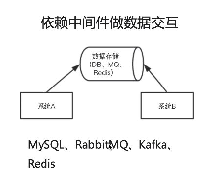
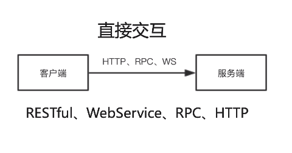
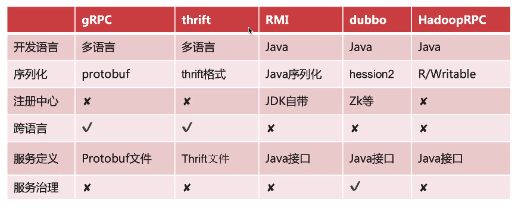
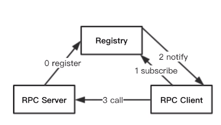
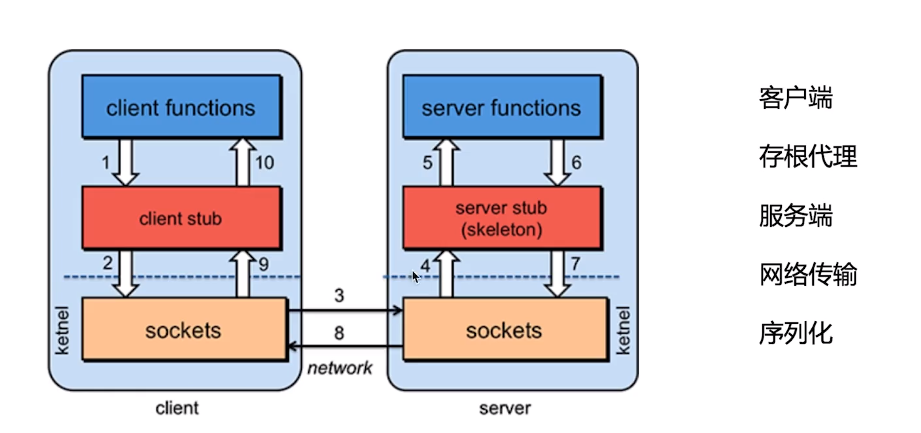
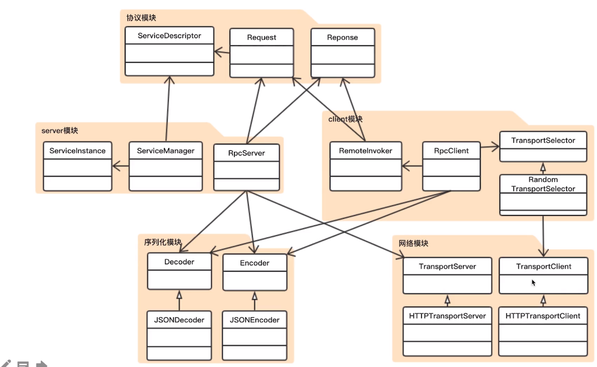

# javaRPC
慕课网入门项目

## 理论

### RPC概念

Remote Procedure Call远程过程调用，分布式系统常见的通信方法。

java中有返回值的方法称为函数，没有返回值的方法称之为过程。

跨进程的交互形式：Restful，webservice，http，以及基于DB做数据交换，基于MQ做数据交换还有RPC。

### RPC现有框架对比

依赖中间件做数据交互，中间件包括mysql，rabbitMQ，Kafka，Redis，在交互的时候将数据存入中间件中，由另一个系统提取



直接交互：对响应速度的要求高，本机的速度直接影响数据交换速度



在RPC中：server：provider，client：Consumer以及存根（负责序列化以及反序列化的模块）

RPC可以像调用本地方法一样调用远程方法。目前RPC已经是一个较为成熟的技术，已有了多种开源工具，如下所示：



跨语言表示：客户端与服务端可以适用不同的编程语言。

服务治理：RPC调用加上对服务的综合管理，例如注册中心，权限控制，服务监控等。

### 原理剖析



server:暴露服务，服务提供方

client：服务消费，调用远程服务

registry：服务注册与发现

执行方式：rpc先将需要暴露的服务注册到注册中心，client订阅组测中心，取得需要的服务的地址信息，最后执行调用。



 (1) 客户端（client）以本地调用方式（即以接口的方式）调用服务；
(2) 客户端存根（client stub）接收到调用后，负责将方法、参数等组装成能够进行网络传输的消息体（将消息体对象序列化为二进制）；
(3) 客户端通过sockets将消息发送到服务端；
(4) 服务端存根( server stub）收到消息后进行解码（将消息对象反序列化）；服务端存根一般会做成单例
(5) 服务端存根( server stub）根据解码结果调用本地的服务；
(6) 本地服务执行并将结果返回给服务端存根( server stub）；
(7) 服务端存根( server stub）将返回结果打包成消息（将结果消息对象序列化）；
(8) 服务端（server）通过sockets将消息发送到客户端；
(9) 客户端存根（client stub）接收到结果消息，并进行解码（将结果消息发序列化）；
(10) 客户端（client）得到最终结果。
RPC的目标是要把2、3、4、7、8、9这些步骤都封装起来。
注意：无论是何种类型的数据，最终都需要转换成二进制流在网络上进行传输，数据的发送方需要将对象转换为二进制流，而数据的接收方则需要把二进制流再恢复为对象。 

模块：clent端——序列化模块——网络模块——server端

### 技术栈

基础知识：java，maven（多模块），反射知识，

动态代理：

java的动态代理——局限性：只能代替接口

序列化：一般就是方法、参数等序列化为字符串，因为字符串可以方便的转为二进制数据。

网络通信：jetty，urlConnection

### 项目架构



#### 项目目录架构

```
|   \---inspectionProfiles
+---javaRPC-client //客户端模块
|   \---src
|       +---main
|       |   +---java
|       |   \---resources
|       \---test
|           \---java
+---javaRPC-codec //序列化模块
|   \---src
|       +---main
|       |   +---java
|       |   \---resources
|       \---test
|           \---java
+---javaRPC-common //通用模块——工具类
|   \---src
|       +---main
|       |   +---java
|       |   \---resources
|       \---test
|           \---java
+---javaRPC-proto //协议模块
|   \---src
|       +---main
|       |   +---java
|       |   \---resources
|       \---test
|           \---java
+---javaRPC-server //网络模块
|   \---src
|       +---main
|       |   +---java
|       |   \---resources
|       \---test
|           \---java
\---javaRPC-transport //转发模块
    \---src
        +---main
        |   +---java
        |   \---resources
        \---test
            \---java

```

### 模块分析

#### common模块

里面只有一个ReflectionUtils，利用放射来创建对象的实例，三个静态方法

1. newInstance:返回对象实例
2. getPublicMethods:返回对象中的全部public方法，也就是暴露出来的服务
3. invoke:传递一个对象object并调用这个对象的method方法，args是这个方法所需要的参数

#### proto协议模块

协议模块中有四个：

1. Peer：定义了网络通信中的一个端点，主机号以及端口，因为这个项目是基于http协议的，http协议的结构为http://+host+port
2. request:表示RPC的一个请求，请求需要的服务的描述信息以及传递请求的服务需要的参数
3. response:表示RPC的返回值，其中存有http响应的编码，以及相应的数据和错误信息，就是最后的得到的实例化的对象
4. servicedescriptor：服务描述项目：通过类类型，方法名、返回类型以及所需要的参数类型描述一个唯一的服务类型。并重写了hashcode和equals方法，TODO
5. 注意这里使用了lombok注解方式对这些对象进行注解，@Data注解的类会自动实现get参数和set参数简单方法

#### codec模块

1. encoder接口以及其具体实现：利用了alibaba的fastjson库将对象解析为二进制数据
2. decoder接口以及具体实现:利用alibaba的fastjson库将二进制数据转为对象。需要传递class对象以及序列化的数据

#### transort模块

网络转发模块，用于处理网络请求

1. requesthandler接口：接受数据流并处理完成后输出结果数据流，这里没有给出具体实现
2. transportClient接口：客户端的网络发送接口，设置目标端口，创建连接并发送数据，等待对方传来的数据，最后关闭连接，connect：连接某个端点，write：将数据写入发送流，并等待对方的相应
3. transportServer：服务端网络发送接口，初始化监听端口，并接受一个handler对象用于处理输入数据以及得到输出数据
4. HttpTransportClient：打开到某个接口主机端口的http连接，并等待对方的数据，将write参数的inputstream写入http的outputstream中，发送到对方指定的url连接中
5. HttpTransportServer：服务端——启动服务端，指定要监听的接口，等待请求的到来，并指定一个处理数据流的handler，用的是ServletContextHandler，（可能是http协议解析之类的工作，http还没学），holder用于接管请求，相当于一个容器，start方法启动服务，并阻塞等待结果，stop关闭服务。

#### service模块

1. serviceInstance：服务实体，表示一个服务以及该服务提供的方法，注意，由于target是一个实际对象
2. servicemanager：用于管理service的模块，提供注册和查找服务的功能，用concurrenthashmap来保存，key为之前proto模块定义的servicedescriptor，value为instance。register注册服务，lookup查找服务
3. RPCserverConfig：提供一个RPC服务端的基本配置信息
4. RPCServer：一个具体的rpc服务端，其配置根据RPCserverConfig并利用反射生成。包括序列化以及反序列化模块，服务调用模块，服务管理模块并实现初始化连接。提供组测服务的功能，并实现了requesthandler，在handler中处理完请求并调用服务之后，将服务的结果返回，注意在这个过程中，被序列化和反序列化的对象是request和response
5. ServiceInvoke：利用反射调用实例的方法。

#### client模块

1. transportseletor：选择与某个服务建立连接，需提供peer对象，count和class对象
2. RpcClientConfig：客户端配置，网络发送接口，序列化和反序列化模块，以及一个服务选择模块Selector
3. remoteInvoke:随机地从可用地连接中选择一个将一个服务请求包装为request对象序列化后用client进行发送，得到response之后反序列化之后返回，该类实现了innovationHandler接口地invoke方法
4. RandomTransportSelector：对每个端口提供多个http连接，select从其中选择一个服务端口提供服务，注意到多线程问题，需要设置同步，release将使用完的服务加会表中
5. RpcClient:客户端实例

### 在实现项目的过程中遇到的奇怪的问题

1. 如果遇到java.lang.ClassNotFoundException异常，那么表示有某个模块还没有build，检查target文件夹下是否有编译好的class文件，没有就对模块执行build命令
2. 注意setting文件中注意格式问题，如果缩进不正确或者多出了一些额外符号可能会导致无法完成编译。

